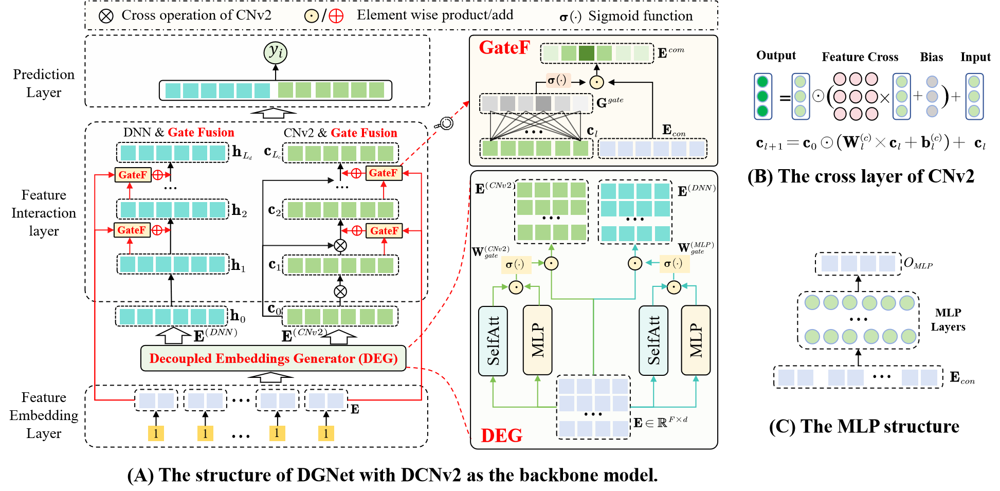

# DGNet: Enhancing Parallel CTR Prediction Models via Decoupled Gated Network
## The structure of DGNet. 

(A) The structure of DGNet with DCNv2 as the backbone model. DGNet contains two core components: the decoupled embedding generator (DEG) and the gate fusion network (GateF). (B) The $l$-th cross layer of CNv2 operation. (C) The structure of MLP network.

## Mainly Requirements
python==3.10.8
torch==2.3.0+cu121


### Run the code
```CUDA_VISIBLE_DEVICES=0 python run_base.py```


